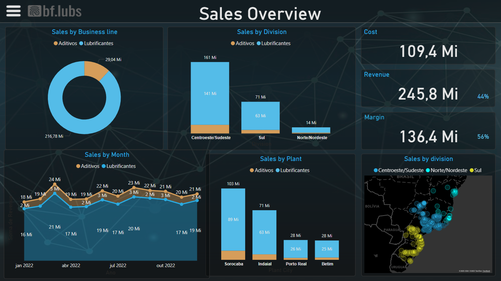

## 📊 Prévia do Dashboard


---

## 📈 Insights Estratégicos Gerados

Este dashboard foi projetado para gerar insights acionáveis, incluindo:

*   **Identificação de Mercados Chave**: Reconheça as regiões com maior participação de mercado e potencial de crescimento.
*   **Otimização Financeira**: Compare receita, custo e margem para embasar decisões estratégicas e otimizar a lucratividade.
*   **Monitoramento de Desempenho**: Acompanhe de perto o desempenho mensal das vendas e identifique tendências.
*   **Avaliação de Unidades de Produção**: Entenda a contribuição de cada planta para o resultado geral da empresa.
*   **Compreensão Geográfica**: Visualize a distribuição das vendas para direcionar esforços de marketing e logística.

---

## 🛠 Tecnologias Utilizadas

*   **Microsoft Power BI Desktop**: Ferramenta para ETL (Extração, Transformação, Carga), modelagem de dados e criação de visualizações.
*   **Power BI Service**: Plataforma para publicação e compartilhamento seguro do dashboard online.
*   **Excel / CSV**: Utilizado para preparação e armazenamento inicial dos dados.
*   **Git & GitHub**: Essenciais para versionamento do código e colaboração no projeto.

---

## ⬇️ Como Utilizar o Projeto

### 1. Acessar Online (Recomendado)

Para uma visualização rápida e interativa, basta clicar no link abaixo. Não é necessário baixar ou instalar nenhum software:

🔗 [**Abrir o Dashboard no Power BI Service**](https://app.powerbi.com/groups/me/reports/384ee54d-c121-48f3-bdab-8f2ba29472de/48f3c53442e89a355120?experience=power-bi&bookmarkGuid=5385fdfaf79184a284ab )

### 2. Baixar o Projeto Localmente

Se você deseja explorar o projeto no Power BI Desktop ou contribuir, clone o repositório para sua máquina local:

```bash
git clone https://github.com/seu-usuario/sales-overview-powerbi.git
cd sales-overview-powerbi

